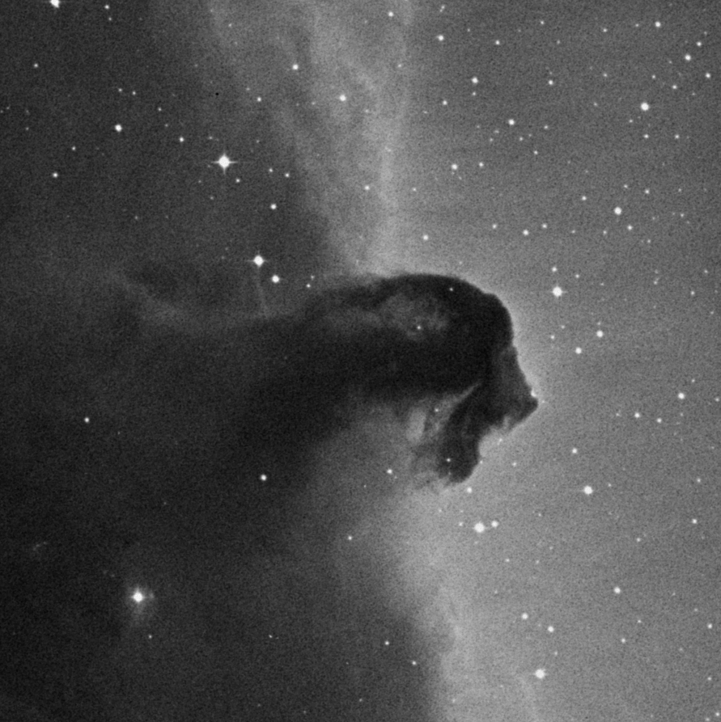
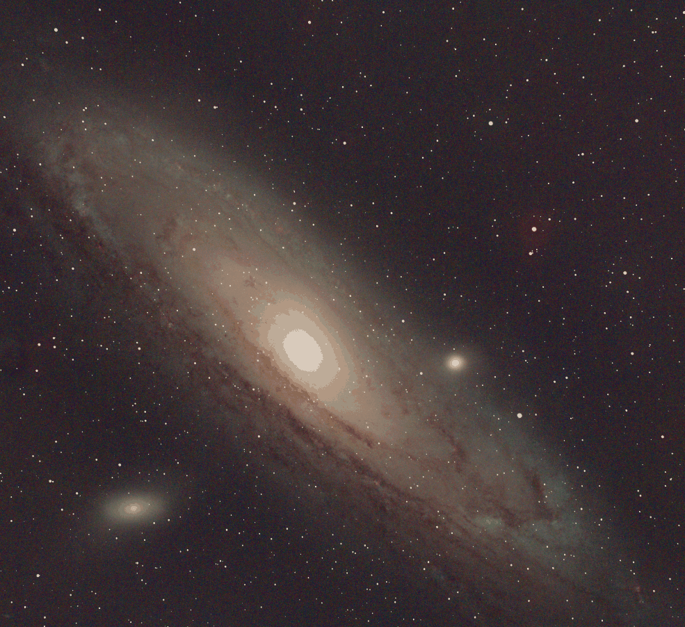
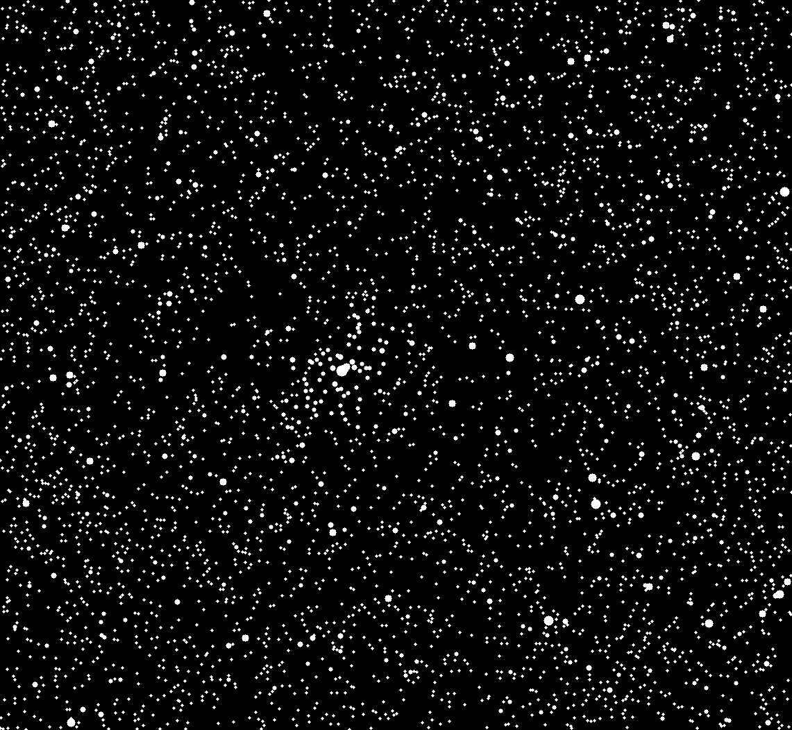

# 🌠 StarEX (beta 1.2.1)


A simple but useful tool to achieve star reduction on .FITS files, using the Astropy.io and OpenCV libraries.

To get started, refer to the following documentation: [Terminal Commands](docs/COMMANDS.md)

[](https://classroom.github.com/a/zP0O23M7)

## Demo





## Authors

- MELOCCO David [@ThFoxY](https://www.github.com/ThFoxY)
- LECLERCQ-SPETER Simon [@Koshy](https://www.github.com/KoshyMVP)
- COLIN Noé [@Kiizer](https://www.github.com/Kiizer861)

**For this project, we wanted to be professional:**
* No unnecessary and poorly documented commits: before each push, the added/modified or deleted code was carefully analyzed. It took us a little time, but we were satisfied with the result!
* Fair division between work parts: each of us did our part. Whether it was documentation, optimization, or adding features, we were able to develop a tool that is fulfilling, despite the tight deadlines. The last commits were made on @ThFoxY's account (there were three of us, then two 😓 until the end of the night) to facilitate the commits. Everyone participated until the last day!
* Following the effective development course **(R3.02)**, we decided to explicitly type all (perhaps with a few mistakes, it's difficult you know?) our variables and write docstrings (it's true that auto-completion was our best friend!).
* During the first few days (until Thursday), the use of AI was very limited: the goal was to encourage reading the documentation, developing a clean algorithm, and understanding the subject. Due to time constraints, translations were submitted to translators and some repetitive parts were generated. No piece of code was put in without knowing its purpose or meaning!
* The English language is universal: it predominates in the scientific domain. We opted for accessible and open documentation!

> **Summary:** it is pretty good for a tool made in a single week! Most professionnal project we ever done. Very interesting subject too!

## What's StarEX?

StarEX is an algorithm created in one week to process .FITS images with precision and scientific accuracy.

Here are the challenges we selected and the reasons why some were not chosen:

* ❌ **Astrometry via API:** Use the Astrometry.net API to send your image and get an accurate star mask.

    * Integrating an API (with a backend server, a frontend client, and requiring access to an API key) in just one week was not possible. Moreover, the API was developed in 2009, and access to simple, easy-to-use documentation is nowhere to be found. Here's the source code for the [Client side](https://github.com/dstndstn/astrometry.net/blob/main/net/client/client.py) alone.
    * For many teams, this was a waste of time and the expected result was not profitable.

* ✅ **Multi-size reduction:** Large stars require greater erosion than small ones.

    * The algorithm contains a method to process multi-size reduction. The way it works is with the magnitude of a star. The higher the magnitude, the bigger the circular kernel is when processing. Simple right?

* ❌ **User Interface:** Develop an interface that allows users to load a FITS file and adjust the reduction strength in real time.

    * Almost every group went with an GUI. However, our goal was to have an optimized and accurate tool. No need to have an user interface to do so!
    * Moreover, AI can generate a whole Qt application nowadays. For us, it was a waste of time.

* 🕒 **Machine Learning Detection:** Train a small neural network to separate stars from the background.

    * No possible in a week, as it would take a lot of data and hours to be able to do anything.
    * However, it might be interesting experimenting after the assessment due date!

* ✅ **Before/After Comparator:** Create a visualization tool that allows you to quickly overlay the original image and the processed image.

    * With the `compare`command, you can generate two images side-by-side in a single .png file.
    * With the `-b` or `--blink` option, you can generate a gif with a specified delay that switches between the original image and the processed one!

* ✅ **Batch Processing:** Develop a “command line” mode that allows multiple FITS images to be processed automatically.

    * This is what makes StarEX lighweighted and easy-to-use! You can pass a single file, a list of file or even a directory that contains .FITS file and then apply specific process options.
    * The CLI comes with a progress bar and colors thanks to the **tqdm** and **Click** libraries.

> This is a beta, because no tests were done and some bugs might still occurs!

## Installation

**A stable version of Python is required (< 3.13)**. A higher version may cause undesirable results or errors.

* See requirements.txt for full dependency list

### Libraries

* Astropy.io **7.2.0** - [User Guide](https://docs.astropy.org/en/stable/index_user_docs.html)
* Matplotlib **3.10.8** - [API Reference](https://matplotlib.org/stable/api/index.html)
* NumPy **2.20** - [Docs](https://numpy.org/doc/)
* OpenCV for Python **4.12.0.88** - [Modules](https://docs.opencv.org/4.x/index.html)
* Photutils **2.3.0** - [User Guide](https://photutils.readthedocs.io/en/stable/user_guide/index.html)
* Tabulate **0.9.0** - [Full Guide](https://www.datacamp.com/tutorial/python-tabulate)
* Click **8.3.1** [Docs](https://click.palletsprojects.com/en/stable/#documentation)
* tqdm **0.9.0** [GitHub](https://tqdm.github.io/)

### Virtual Environment

It is recommended to create a virtual environment before installing dependencies:
```bash
python -m venv venv
source venv/bin/activate  # On Windows: venv\Scripts\activate
pip install -r requirements.txt
```

Troubleshooting for Powershell:
```bash
Set-ExecutionPolicy -Scope CurrentUser -ExecutionPolicy RemoteSigned
```

### Dependencies
```bash
pip install -r requirements.txt
```

Or install dependencies manually (specified above):
```bash
pip install [package-name]
```

## Examples files
Example files are located in the `examples/` directory. You can run the scripts with these files to see how they work.
- Example 1: `examples/HorseHead.fits` (Black and white FITS image file for testing)
- Example 2: `examples/test_M31_linear.fits` (Color FITS image file for testing)
- Example 3: `examples/test_M31_raw.fits` (Color FITS image file for testing)